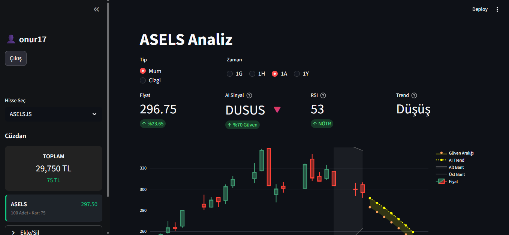
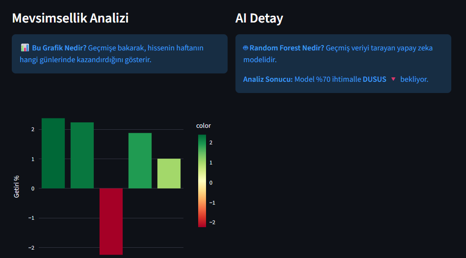
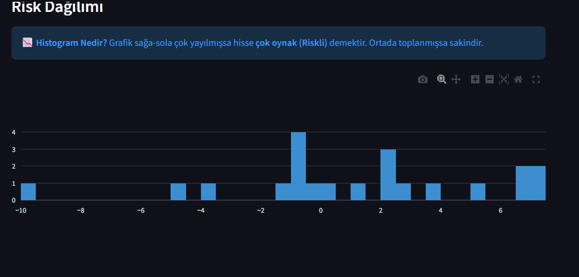

# 💎 Borsa Pro - AI Destekli Finansal Analiz Terminali

Bu proje, yatırımcıların hisse senedi, emtia (Altın/Gümüş) ve döviz kurlarını tek bir ekrandan takip etmelerini, teknik analiz yapmalarını ve yapay zeka desteğiyle trend yönünü öngörmelerini sağlayan gelişmiş bir web uygulamasıdır.

🔗 **Canlı Demo:** [Uygulamayı Buradan Deneyin](https://borsauygulama-j6bscb7jfkuham8atucrjr.streamlit.app)

## 🚀 Öne Çıkan Özellikler

* **📊 Gelişmiş Grafikler:** Plotly altyapısı ile interaktif mum ve çizgi grafikleri. Otomatik zoom ve odaklama özelliği.
* **🤖 Yapay Zeka (AI) Desteği:** * **Random Forest:** Geçmiş 2 yıllık veriyi tarayarak fiyatın yönünü (Yükseliş/Düşüş) tahmin eder.
    * **Polinom Regresyon:** Fiyatın matematiksel ana trendini ve güven aralıklarını çizer.
* **🆚 Akıllı Kıyaslama:** Herhangi bir hisseyi Dolar, Euro, BIST100 veya portföydeki başka bir varlıkla "Yüzdesel Getiri" bazında karşılaştırır.
* **🧬 Mevsimsellik Analizi:** Hissenin geçmişte haftanın hangi günlerinde kazandırdığını istatistiksel olarak sunar.
* **🔔 Alarm Sistemi:** Belirlenen fiyat seviyelerine gelindiğinde kullanıcıya e-posta (SMTP) ile bildirim gönderir.
* **💰 Portföy Yönetimi:** SQLite veritabanı ile kullanıcı bazlı portföy takibi ve kar/zarar hesabı.
* **🛠️ Özel Algoritmalar:** Gram Altın ve Gümüş için Ons/Dolar paritesi üzerinden gerçek zamanlı mum grafiği oluşturma ve *Timezone* hatalarını gideren veri temizleme algoritmaları.

## 🛠️ Kullanılan Teknolojiler

* **Dil:** Python 3.10+
* **Arayüz:** Streamlit
* **Veri Analizi:** Pandas, NumPy
* **Makine Öğrenmesi:** Scikit-Learn (Sklearn)
* **Görselleştirme:** Plotly Express & Graph Objects
* **Veri Kaynağı:** yfinance API
* **Veritabanı:** SQLite3

## 📦 Kurulum (Local)

Bu projeyi kendi bilgisayarınızda çalıştırmak için:

1.  Repoyu klonlayın:
    ```bash
    git clone [https://github.com/onurtnrklu17/borsauygulama.git](https://github.com/onurtnrklu17/borsauygulama.git)
    ```
2.  Gerekli kütüphaneleri yükleyin:
    ```bash
    pip install -r requirements.txt
    ```
3.  Uygulamayı başlatın:
    ```bash
    streamlit run app.py
    ```

## 📷 Ekran Görüntüleri

## 📷 Ekran Görüntüleri








---
Developed by **Onur** | 2026
